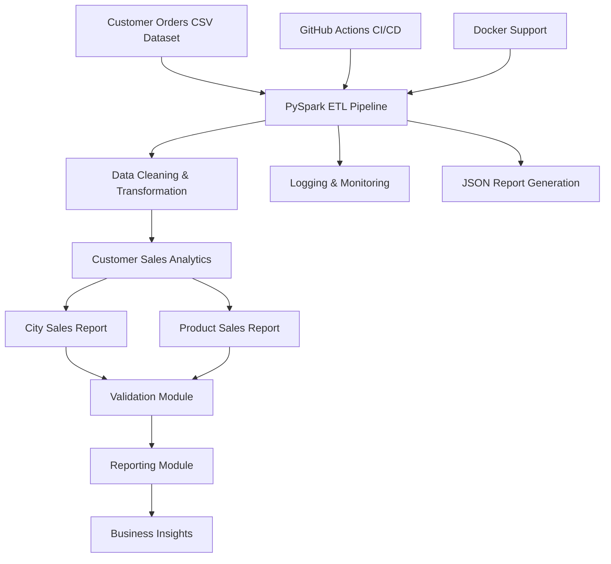
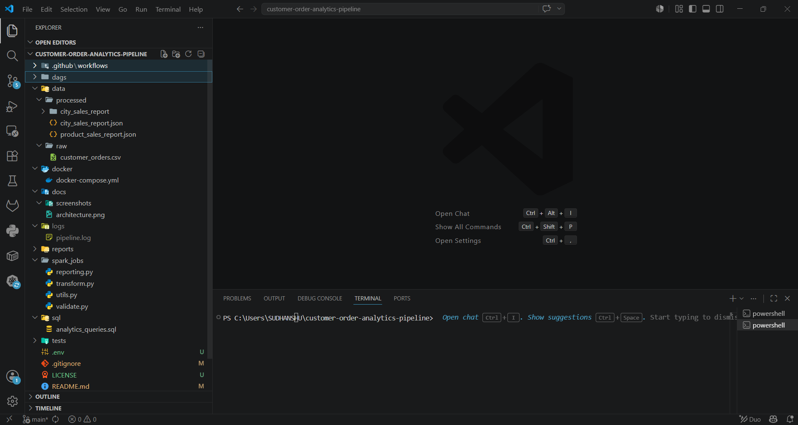
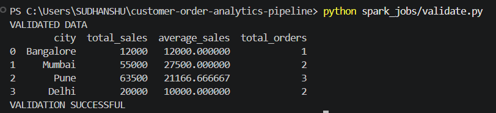
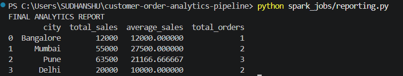
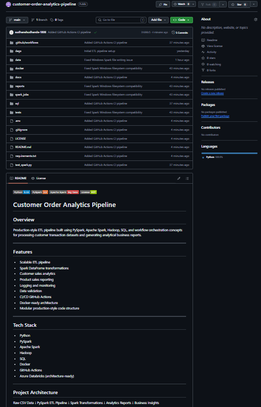
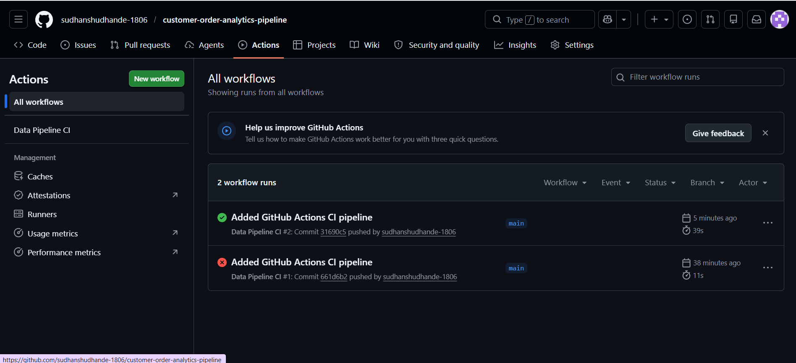

# Customer Order Analytics Pipeline


---

# Overview

Production-style ETL pipeline built using PySpark, Apache Spark, Hadoop, SQL concepts, and workflow orchestration techniques for processing customer transaction datasets and generating analytical business reports.

This project demonstrates scalable batch data processing, Spark DataFrame transformations, modular architecture, logging, reporting, and CI/CD integration for Data Engineering workflows.

---

# Features

- Scalable ETL pipeline
- PySpark DataFrame transformations
- Customer sales analytics
- Product sales reporting
- Logging and monitoring
- Data validation
- Reporting module
- CI/CD GitHub Actions
- Docker-ready architecture
- Modular production-style code structure

---

# Tech Stack

- Python
- PySpark
- Apache Spark
- Hadoop
- SQL Concepts
- Docker
- GitHub Actions
- Azure Databricks (Architecture Ready)

---

# Architecture



---

# Project Structure

```text
customer-order-analytics-pipeline/
│
├── dags/
│   └── etl_pipeline.py
│
├── data/
│   ├── raw/
│   │   └── customer_orders.csv
│   │
│   └── processed/
│       ├── city_sales_report.json
│       └── product_sales_report.json
│
├── docker/
│   └── docker-compose.yml
│
├── docs/
│   ├── architecture.png
│   └── screenshots/
│
├── logs/
│   └── pipeline.log
│
├── reports/
│   └── business_summary.txt
│
├── spark_jobs/
│   ├── transform.py
│   ├── validate.py
│   ├── reporting.py
│   └── utils.py
│
├── sql/
│   └── analytics_queries.sql
│
├── tests/
│   └── test_pipeline.py
│
├── .github/
│   └── workflows/
│       └── ci.yml
│
├── .gitignore
├── LICENSE
├── README.md
├── requirements.txt
└── test_spark.py
```

---

# Screenshots

## VS Code Project Structure



---

## ETL Pipeline Output


---

## Validation Output



---

## Reporting Output



---

## GitHub Repository



---

## GitHub Actions CI/CD



---

# Dataset

Sample customer transaction dataset used for ETL processing.

Columns:

- order_id
- customer_id
- product
- amount
- city
- order_date

---

# ETL Workflow

1. Read raw CSV dataset
2. Perform data cleaning
3. Apply Spark transformations
4. Generate customer sales analytics
5. Generate product sales analytics
6. Validate processed data
7. Generate analytical reports
8. Store processed outputs
9. Log pipeline execution

---

# Run Project

## Run ETL Pipeline

```bash
python spark_jobs/transform.py
```

---

## Run Validation

```bash
python spark_jobs/validate.py
```

---

## Run Reporting

```bash
python spark_jobs/reporting.py
```

---

# Output Files

Generated outputs:

- city_sales_report.json
- product_sales_report.json
- pipeline.log
- business_summary.txt

---

# Logging

Pipeline logs are stored inside:

```text
logs/pipeline.log
```

---

# Testing

Run unit tests:

```bash
python tests/test_pipeline.py
```

---

# Docker Support

Docker configuration available inside:

```text
docker/docker-compose.yml
```

---

# CI/CD Pipeline

GitHub Actions workflow automatically:

- installs dependencies
- validates pipeline
- runs tests

Workflow file:

```text
.github/workflows/ci.yml
```

---

# Future Improvements

- Kafka Streaming Integration
- Azure Databricks Deployment
- Delta Lake Support
- Real-Time Analytics
- Cloud Deployment
- Airflow on Linux/WSL
- Data Lake Architecture

---

# Resume Description

Built a production-style Customer Order Analytics ETL Pipeline using Apache Spark, PySpark, Hadoop, SQL concepts, and workflow orchestration for processing customer transaction datasets. Implemented Spark DataFrame transformations, logging, data validation, analytical reporting, modular architecture, and CI/CD integration for scalable batch data processing.

---

# Author

Sudhanshu Dhande

GitHub:
https://github.com/sudhanshudhande-1806

---
